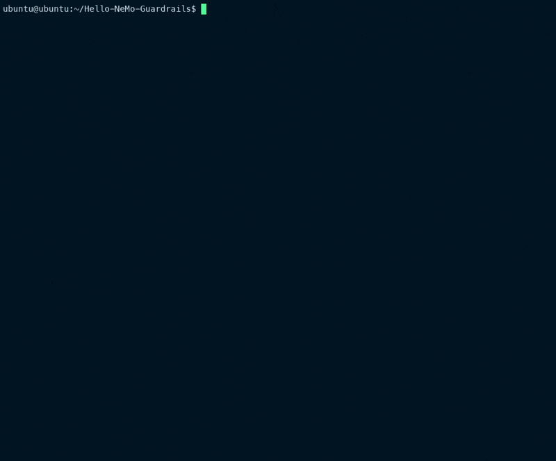

# Hello-NeMo-Guardrails

## Introduction

This project provides a practical introduction to NVIDIA NeMo Guardrails, an open-source toolkit for adding programmable guardrails to Large Language Model (LLM) based conversational systems. NeMo Guardrails enables developers to define, implement, and enforce rules that guide and constrain the behavior of LLMs to ensure safer, more controllable, and more reliable interactions.

The examples in this repository can run with either OpenAI or NIM (NVIDIA Inference Microservice) LLM backends.



## What are Guardrails?

Guardrails are programmable constraints that help control LLM behavior. They can help with:

- **Safety**: Preventing harmful, toxic, or inappropriate content
- **Topical Control**: Keeping conversations on topic and determining what subjects an AI can or cannot discuss
- **Factual Accuracy**: Ensuring responses are grounded in facts and avoiding hallucinations
- **Action Execution**: Securely connecting LLMs to external tools and services
- **Conversation Flow**: Directing conversation along predefined paths

## Examples in this Repository

This repository contains several example implementations of NeMo Guardrails:

1. **Custom Actions** (`actions.py`): Demonstrates how to implement and use custom actions to get time, date, and weather information.

2. **Fact Checking** (`fact_checking.py`): Shows a basic approach to fact checking and knowledge retrieval using a simple knowledge base.

3. **Jailbreak Prevention** (`jailbreak.py`): Illustrates how to implement guardrails that protect against common LLM vulnerabilities like jailbreak attempts.

4. **Topical Rails** (`topical.py`): Demonstrates setting up guardrails that guide the bot to avoid specific topics (politics, stock market) while allowing it to respond to desired ones (cooking recipes).

## Getting Started

### Prerequisites

- Python 3.9, 3.10, 3.11, or 3.12
- **For OpenAI mode**: An OpenAI API key
- **For NIM mode**: Access to an NIM endpoint running the needed model

### Installation

1. Clone this repository:
   ```
   git clone https://github.com/yourusername/Hello-NeMo-Guardrails.git
   cd Hello-NeMo-Guardrails
   ```

2. Install NeMo Guardrails and dependencies:
   ```
   pip install -r requirements.txt
   ```

3. If using OpenAI (default mode), set up your API key:
   ```
   echo "OPENAI_API_KEY=your-api-key-here" > .env
   ```

## Running with OpenAI (Default)

Obtain and export an OpenAI API key
```bash
export OPENAI_API_KEY=<your_API_key>
```

The examples are configured to use OpenAI models by default. Each example can be run independently:

```bash
python actions.py
python fact_checking.py
python jailbreak.py
python topical.py
```

## Running with NIM

### Setting up a NIM Endpoint

To use these examples with NIM, you need to have a running NIM endpoint with the Meta Llama 3.1 model. 

1. **NIM Deployment**:
   - The examples are configured to use the `meta/llama-3.1-8b-instruct` model
   - For instructions on deploying this model via NIM, see: [Meta Llama 3.1 Deployment Guide](https://build.nvidia.com/meta/llama-3_1-8b-instruct/deploy)
   - The examples expect the NIM endpoint to be available at `http://localhost:8000/v1`
   - If you need GPU resources, you can provision systems from [brev.nvidia.com](https://brev.nvidia.com)

2. **Required Packages**:
   - The `langchain-nvidia-ai-endpoints` package is required for NIM integration
   - This is included in the `requirements.txt` file

3. **Running Examples with NIM**:
   - Use the `-n` (short) or `--nim` (long) flag to switch to NIM mode
   
   ```bash
   python actions.py -n
   python fact_checking.py --nim
   python jailbreak.py -n
   python topical.py --nim
   ```

4. **No OpenAI API Key Required**:
   - When using the NIM mode, you don't need to configure an OpenAI API key

## Project Structure

```
├── actions.py               # Custom actions example
├── fact_checking.py         # Fact checking example
├── jailbreak.py             # Jailbreak prevention example
├── topical.py               # Topical rails example
├── config_actions/          # Configuration for actions example
│   ├── config.yml           # Configuration file (used with OpenAI by default)
├── config_fact_checking/    # Configuration for fact checking example
│   ├── config.yml           # Configuration file (used with OpenAI by default)
├── config_jailbreak/        # Configuration for jailbreak prevention example
│   ├── config.yml           # Configuration file (used with OpenAI by default)
├── config_topical/          # Configuration for topical rails example
│   ├── config.yml           # Configuration file (used with OpenAI by default)
```

Each configuration directory contains the necessary files for that example, including:
- `config.yml`: Configuration file for the guardrails
- `rails.co` or similar: Colang files defining the rails
- Additional files specific to each example

## Key Concepts

### Colang

Colang is a domain-specific language designed for defining guardrails. It allows you to specify:

- User and bot message patterns
- Conversation flows
- Actions that can be executed
- Topic definitions

### Rails Configuration

The configuration for each guardrail is defined in the corresponding config directory:

- The `config.yml` file contains the base configuration (used with OpenAI by default)
- The `.co` files contain the Colang definitions for the guardrails behavior

When using the `-n` or `--nim` flag, the code programmatically modifies the configuration to use a local NIM endpoint with these settings:

```yaml
models:
  - type: main
    engine: nim
    model: meta/llama-3.1-8b-instruct
    parameters:
      base_url: http://localhost:8000/v1
```

The same Colang rail definitions are used regardless of which LLM provider (OpenAI or NIM) is selected.

## Learn More

- [NeMo Guardrails Documentation](https://docs.nvidia.com/nemo/guardrails/index.html)
- [NeMo Guardrails Configuration Guide for NIM](https://docs.nvidia.com/nemo/guardrails/latest/user-guides/configuration-guide.html#nim-for-llms)
- [NeMo Guardrails GitHub Repository](https://github.com/NVIDIA/NeMo-Guardrails)
- [NVIDIA Developer Resources](https://developer.nvidia.com/nemo-guardrails)
- [Meta Llama 3.1 Deployment on NIM](https://build.nvidia.com/meta/llama-3_1-8b-instruct/deploy)

